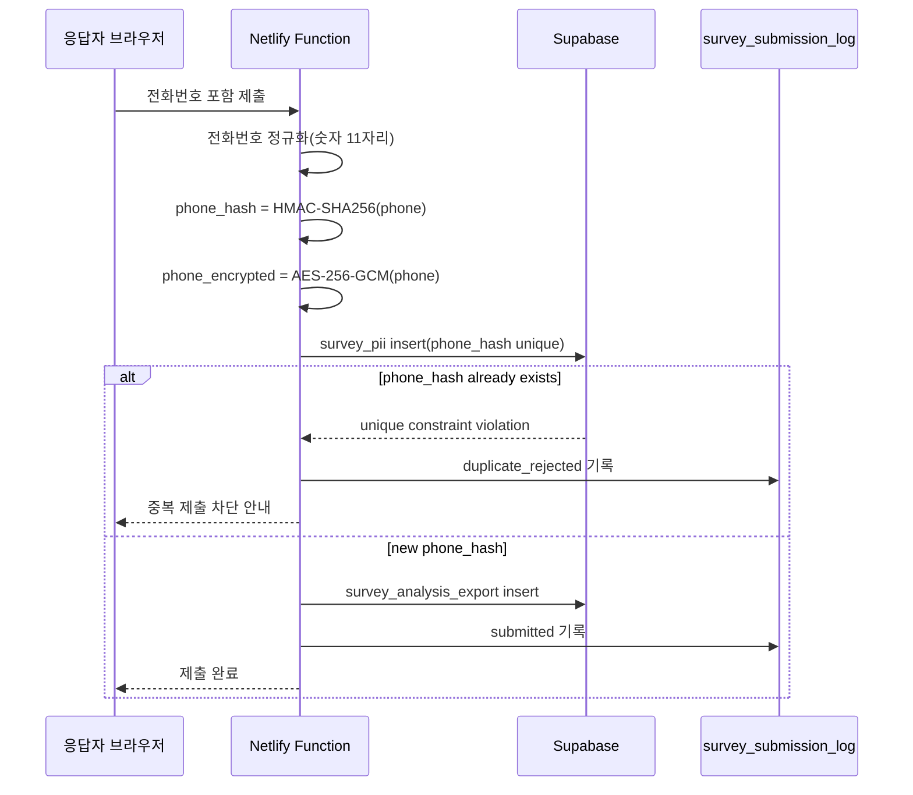

# Phone Encryption And Decryption Operations

이 문서는 조사폼 응답 제출 흐름에서 전화번호 암호화/해시 처리가 언제 개입되는지, Supabase에는 어떤 값이 저장되는지, 운영자가 어떤 조건에서 로컬 복호화를 수행하는지 정리합니다.

## 핵심 원칙

- 전화번호 원문은 브라우저와 Netlify Function의 요청 처리 메모리에서만 일시적으로 존재합니다.
- Supabase와 Google Sheets 백업에는 전화번호 원문을 저장하지 않습니다.
- 중복 제출 방지는 복호화 불가능한 `phone_hash`로 처리합니다.
- 사후 본인 확인, 답례, 운영 확인이 필요한 경우에만 `phone_encrypted`를 로컬에서 복호화합니다.
- 분석용 CSV에는 `phone_hash`, `phone_encrypted`, 복호화 전화번호를 포함하지 않습니다.

## 저장 값

| Field | Storage | Purpose | Reversible |
| --- | --- | --- | --- |
| `phone_hash` | `survey_pii` | 중복 제출 확인용 HMAC-SHA256 값 | No |
| `phone_encrypted` | `survey_pii` | 사후 운영 확인용 AES-256-GCM 암호문 | Yes, with key |
| `phone_encryption_version` | `survey_pii` | 암호화 키/알고리즘 버전 식별 | No |

## 제출 시점 처리 흐름



## 비밀값 관리

Netlify 환경변수:

- `PHONE_ENCRYPTION_KEY`: 32바이트 랜덤 키를 base64로 인코딩한 값
- `PHONE_HASH_SECRET`: HMAC-SHA256용 긴 랜덤 문자열

운영 원칙:

- 두 값은 GitHub, Notion, 이슈, 채팅에 기록하지 않습니다.
- `PHONE_HASH_SECRET`은 중복조회 일관성에 필요하므로 임의 교체하지 않습니다.
- `PHONE_ENCRYPTION_KEY`는 복호화 담당자만 접근 가능한 로컬 보안 보관소에 별도 보관합니다.
- 키를 교체할 경우 `phone_encryption_version`을 올리고, 버전별 복호화 키 보관 정책을 먼저 확정합니다.

## 로컬 비밀값 생성

PowerShell:

```powershell
node -e "const crypto=require('crypto'); console.log('PHONE_ENCRYPTION_KEY='+crypto.randomBytes(32).toString('base64')); console.log('PHONE_HASH_SECRET='+crypto.randomBytes(48).toString('base64url'))"
```

생성한 값은 Netlify 환경변수와 복호화 담당자의 로컬 보안 보관소에만 저장합니다.

로컬 개발환경에서는 예시로 `local-secrets/phone-encryption.env`를 사용할 수 있습니다. 이 파일은 `.gitignore`에 포함되어야 하며 GitHub에 올리지 않습니다.

## 복호화 수행 조건

복호화는 상시 업무가 아니라 제한된 운영 작업입니다.

| 상황 | 허용 여부 | 비고 |
| --- | --- | --- |
| 분석 대시보드 생성 | 불가 | 분석용 데이터만 사용 |
| 일반 직원 원자료 다운로드 | 불가 | 소속 도서관 분석용 원자료만 허용 |
| 자치구 관리자 PII export | 가능 | 해당 자치구 범위만 |
| 시스템 전체 관리자 PII export | 가능 | 전체 범위 가능 |
| 답례 발송/본인 확인 | 가능 | 승인된 운영 목적에 한정 |

## 로컬 복호화 절차

1. 관리자 화면에서 권한 범위에 맞는 PII CSV를 다운로드합니다.
2. 복호화 키를 로컬 환경변수로 설정합니다.
3. 로컬 복호화 스크립트를 실행합니다.
4. 작업 후 복호화 결과 파일의 보관/폐기 기준을 따릅니다.

PowerShell 예시:

```powershell
$env:PHONE_ENCRYPTION_KEY=(Get-Content .\local-secrets\phone-encryption.env | Where-Object { $_ -like "PHONE_ENCRYPTION_KEY=*" }).Split("=", 2)[1]
node scripts/decrypt-phone-csv.mjs --input .\pii.csv --output .\pii-decrypted.csv
```

결과 파일에는 기존 컬럼 뒤에 `phone_decrypted` 또는 `phoneDecrypted` 컬럼이 추가됩니다. 실제 컬럼명은 구현 단계에서 export 규격과 함께 확정합니다.

## Google Sheets 백업과의 관계

Google Sheets는 원천 저장소가 아니라 관리자 백업 대상입니다. 백업 시에도 전화번호 원문은 전송하지 않고 다음 값만 포함합니다.

- `phone_hash`
- `phone_encrypted`
- `phone_encryption_version`
- 개인정보 동의값
- 요청/제출 시각 등 운영 메타데이터

## 키 교체 주의사항

- `PHONE_HASH_SECRET`을 바꾸면 같은 전화번호라도 기존 `phone_hash`와 신규 `phone_hash`가 달라져 중복 검사가 이어지지 않습니다.
- `PHONE_ENCRYPTION_KEY`를 바꾸면 기존 `phone_encrypted`는 이전 키로만 복호화할 수 있습니다.
- 운영 중 키를 교체하려면 `phone_encryption_version`별로 키 보관, 복호화 스크립트 분기, 이전 데이터 처리 방침을 먼저 문서화해야 합니다.

## 구현 전 체크리스트

- [ ] Netlify Function에서 전화번호 정규화 후 해시/암호화 수행
- [ ] `survey_pii.phone_hash` unique index 적용
- [ ] `survey_pii.phone_encrypted` 원문 복원 가능한 암호문으로 저장
- [ ] 분석용 export에서 PII 필드 제외
- [ ] PII export API는 관리자 권한 범위 적용
- [ ] 복호화 스크립트는 로컬에서만 실행
- [ ] 복호화 결과 파일 보관/폐기 기준 확정
