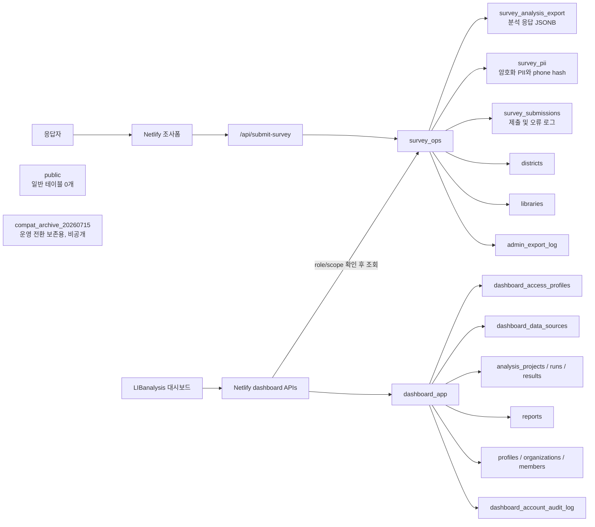

# 조사폼 세션 전달 프롬프트: 2026-07-16 운영 DB 구조 및 작업 맥락

아래 경로의 프로젝트에서 조사폼 작업을 이어서 진행해줘.

```text
C:\Users\geun9\OneDrive\문서\LIBanalysis_2026_survey
```

## 먼저 읽을 문서와 코드

### 현재 운영 DB와 대시보드 기준 문서

아래 문서를 현재 구조의 우선 기준으로 사용해.

```text
C:\Users\geun9\OneDrive\문서\LIBanalysis-v2\docs\product\libanalysis_v2_dashboard_handoff_2026_07_14.md
C:\Users\geun9\OneDrive\문서\LIBanalysis-v2\docs\product\libanalysis_v2_dashboard_db_definition_2026.md
C:\Users\geun9\OneDrive\문서\LIBanalysis-v2\docs\product\same_project_schema_split_interim_plan_2026.md
C:\Users\geun9\OneDrive\문서\LIBanalysis-v2\docs\product\libanalysis_v2_architecture.md
C:\Users\geun9\OneDrive\문서\LIBanalysis-v2\docs\product\libanalysis_v2_payload_schema.md
C:\Users\geun9\OneDrive\문서\LIBanalysis-v2\docs\product\libanalysis_v2_raw_export_mapping_policy_2026.md
C:\Users\geun9\OneDrive\문서\LIBanalysis-v2\docs\nowon_2026_dashboard_question_mapping.csv
C:\Users\geun9\OneDrive\문서\LIBanalysis-v2\docs\product\nowon_2026_question_criteria.md
```

DB 재현 SQL과 migration:

```text
C:\Users\geun9\OneDrive\문서\LIBanalysis-v2\supabase\same_project_schema_tables_2026.sql
C:\Users\geun9\OneDrive\문서\LIBanalysis-v2\supabase\migrations\20260715060849_retire_public_compat_tables.sql
C:\Users\geun9\OneDrive\문서\LIBanalysis-v2\scripts\run-local-supabase-sql.mjs
C:\Users\geun9\OneDrive\문서\LIBanalysis-v2\scripts\seed-local-supabase.mjs
```

### 조사폼 저장·보안·문항 기준

```text
C:\Users\geun9\OneDrive\문서\LIBanalysis_2026_survey\docs\supabase-source-of-truth-plan.md
C:\Users\geun9\OneDrive\문서\LIBanalysis_2026_survey\docs\survey-form-storage-architecture.md
C:\Users\geun9\OneDrive\문서\LIBanalysis_2026_survey\docs\security-data-transfer.md
C:\Users\geun9\OneDrive\문서\LIBanalysis_2026_survey\docs\phone-encryption-operations.md
C:\Users\geun9\OneDrive\문서\LIBanalysis_2026_survey\docs\local-open-text-question-dashboard-handoff.md
C:\Users\geun9\OneDrive\문서\LIBanalysis_2026_survey\src\survey\questionSchema.ts
C:\Users\geun9\OneDrive\문서\LIBanalysis_2026_survey\netlify\functions\submit-survey.mts
```

주의: 조사폼 저장 문서 일부에는 이전 구조인 `public`, `dashboard_users`, `survey_submission_log` 표현이 남아 있을 수 있다. 실제 운영 구조는 이 프롬프트와 대시보드 기준 문서를 우선하고, 작업 시 해당 조사폼 문서를 최신 구조로 정리해.

Notion의 노원구 로컬 서술형 인계 문서:

```text
https://app.notion.com/p/39d91b75d56c816ebf5ccc7a9da09720
```

## 현재 확정된 운영 맥락

- Supabase project: `libanalysis-v2-survey`
- 무료 active project 한도 때문에 조사 운영과 대시보드는 같은 project를 쓰되 schema로 분리한다.
- 조사폼과 조사 데이터의 원천 저장소는 Supabase다.
- Google Sheets는 원천 저장소가 아니라 관리자 백업/export 대상이다.
- 조사폼 production은 `SURVEY_DB_SCHEMA=survey_ops`를 반드시 사용한다.
- `SURVEY_DB_SCHEMA`가 없을 때 `public`으로 자동 fallback하지 않는다.
- `public`의 운영 호환 테이블은 2026-07-15 제거됐으며 현재 일반 테이블은 0개다.
- 제거 전 `public` 데이터는 운영 DB의 비공개 `compat_archive_20260715`에 보존돼 있다. 이 archive를 조사폼 런타임에서 조회하거나 노출하지 않는다.
- 조사폼 PII 없는 제출과 대시보드 조회는 `public` 제거 후에도 운영 검증을 통과했다.
- 운영 분석 응답은 `survey_ops.survey_analysis_export`에 저장된다. 2026-07-16 확인 기준 총 251행이며, 이 중 `request_id like 'sample-%'` 샘플은 250행이다.
- 비밀키, service role key, 암호화·복호화 키, PII 원문은 채팅·로그·문서에 값 그대로 남기지 않는다.

## 최종 DB 구조



### `survey_ops`에 저장하는 테이블

| 테이블 | 조사폼 세션에서 알아야 할 역할 |
| --- | --- |
| `districts` | 자치구 기준정보 |
| `libraries` | 도서관 기준정보 |
| `survey_analysis_export` | 문항 코드별 분석 응답. PII를 넣지 않는다. |
| `survey_pii` | 동의값, `phone_hash`, `phone_encrypted`, 암호화 버전 |
| `survey_submissions` | 제출 성공·검증 실패·중복 차단·저장 실패 로그 |
| `admin_export_log` | 권한 기반 원자료/export 감사 로그 |

### `dashboard_app`에 저장하는 테이블

```text
profiles
organizations
organization_members
dashboard_access_profiles
dashboard_data_sources
analysis_projects
analysis_runs
analysis_results
reports
dashboard_account_audit_log
```

조사폼은 `dashboard_app`에 직접 쓰지 않는다. 대시보드 계정과 권한은 조사 응답 payload에 포함하지 않는다.

## 조사폼 제출 계약

- `netlify/functions/submit-survey.mts`가 허용 문항 코드만 받는다.
- 분석 응답은 `survey_ops.survey_analysis_export.analysis_payload`에 저장한다.
- 전화번호 원문은 DB에 저장하지 않는다.
- 동의한 전화번호는 서버에서 HMAC hash와 AES-256-GCM 암호문으로 변환한다.
- 동일 전화번호 중복은 `phone_hash` unique constraint로 차단한다.
- PII 저장 실패 시 분석 응답도 rollback한다.
- `NW-OE-1`은 선택형 로컬 서술 문항이며 최대 300자다.
- `NW-OE-1`은 원자료에는 보존하지만 기본/심화 분석과 서울도서관 공식 제출 export에서는 제외한다.
- 서술형 원문은 AI 요약, 보고서, 공개 화면에 보내기 전에 제외 또는 마스킹한다.

## Auth와 비밀번호 보호 경계

- 조사폼 응답자는 Supabase Auth 계정을 만들지 않는다. 공개 조사 제출과 대시보드 운영자 로그인은 별개다.
- 대시보드 운영 계정은 공개 회원가입이 아니라 상위 관리자가 `/api/dashboard-users`로 발급한다.
- 현재 Supabase 조직은 Free 플랜이라 leaked-password protection 기능을 사용할 수 없다.
- 권장 운영안은 Supabase Auth의 공개 email signup을 비활성화하고, 관리자 계정 생성 API에서 최소 12자와 영문 대·소문자·숫자·기호 조합을 검증하는 것이다.
- Auth 설정을 바꾸더라도 공개 조사폼의 `/api/submit-survey` 동작에는 영향이 없어야 한다.
- 조사폼에 로그인·회원가입 UI를 추가하지 않는다.

## 로컬 DB 검증 완료 상태

2026-07-16 대시보드 저장소에서 Docker Desktop Linux engine을 실행해 다음을 완료했다.

```text
npm run supabase:reset       통과
npm run supabase:seed:local  통과
npm run supabase:advisors    이슈 0건
npm run typecheck            통과
npm run build                통과
```

재현 결과:

```text
public 일반 테이블: 0
survey_ops 테이블: 6
dashboard_app 테이블: 10
로컬 분석 샘플: 200행
로컬 role 계정/access profile: staff, district_admin, system_admin 각 1개
```

## 세션 시작 시 확인할 것

1. `git status --short`, 최근 commit, 현재 branch를 먼저 확인한다.
2. 조사폼 `npm run typecheck`, `npm run build`를 실행한다.
3. Netlify project가 `libanalysis-2026-survey`에 연결되어 있는지 확인한다.
4. production, deploy-preview, branch-deploy context의 `SURVEY_DB_SCHEMA=survey_ops`를 확인한다.
5. `submit-survey.mts`가 `public` fallback 없이 명시 schema를 요구하는지 확인한다.
6. 문항 또는 export 구조 변경 시 `questionSchema.ts`, 조사폼 문서, 대시보드 mapping CSV를 함께 동기화한다.
7. 테스트 제출은 PII 없는 값으로 수행하고, 생성한 임시 응답과 로그는 확인 후 삭제한다.

## 우선 작업

1. 조사폼 문서의 구형 `public`, `dashboard_users`, `survey_submission_log` 표현을 현재 `survey_ops`/`dashboard_app` 구조에 맞게 정리한다.
2. 조사폼 runtime과 Netlify 환경변수가 최종 DB 구조를 계속 따르는지 검증한다.
3. `NW-OE-1`과 전체 허용 문항 목록이 조사폼, DB 저장, 분석 mapping에서 일치하는지 확인한다.
4. Google Sheets를 원천 저장 경로로 되돌리지 말고 Supabase 백업/export 흐름으로만 유지한다.
5. 비밀번호 보호는 대시보드 계정 영역으로 취급하고 조사폼 공개 제출 흐름과 섞지 않는다.

민감정보 값을 출력하지 말고, 발견한 불일치는 먼저 목록화한 다음 필요한 범위만 수정·검증해줘.
