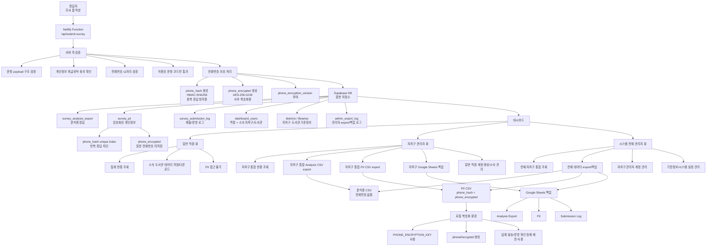
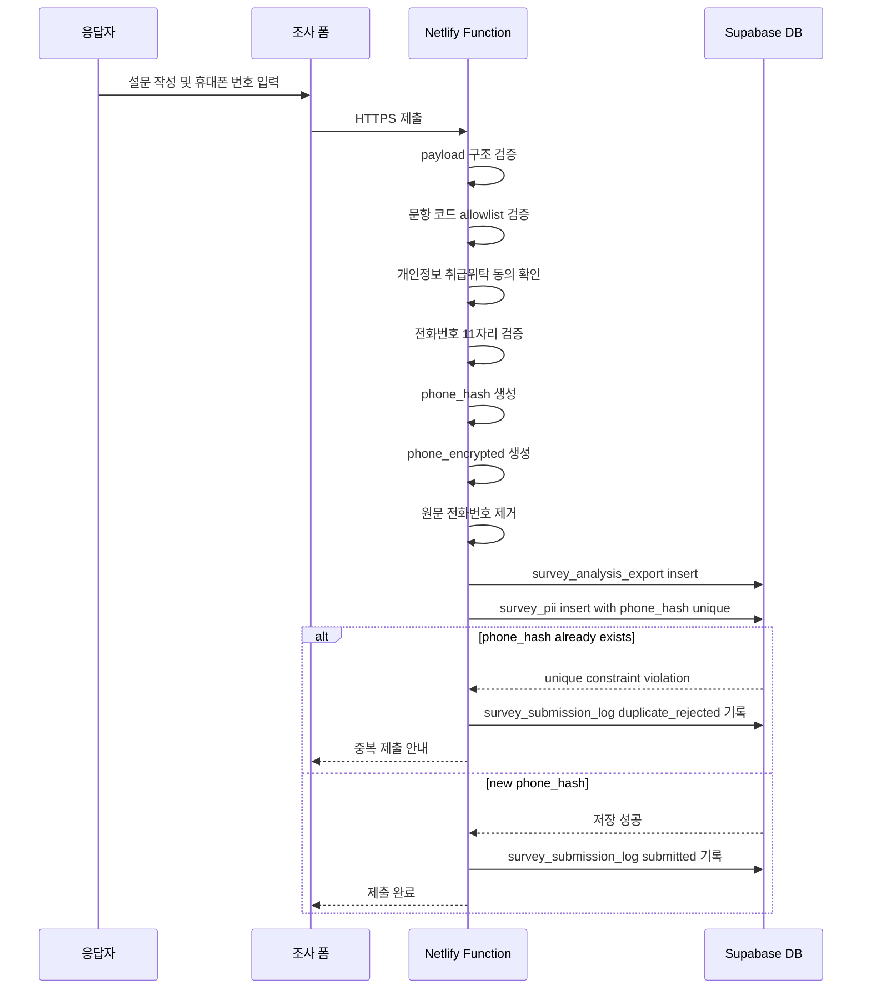
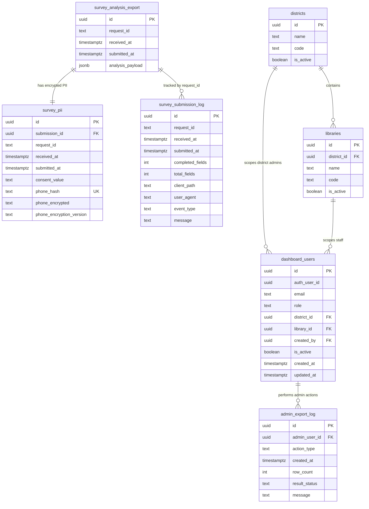
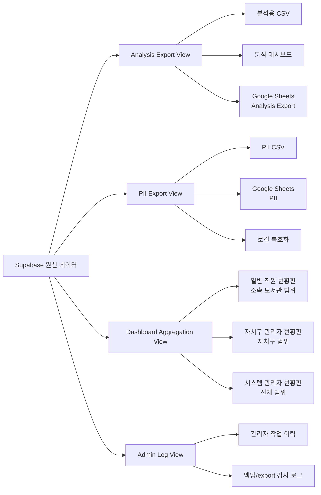
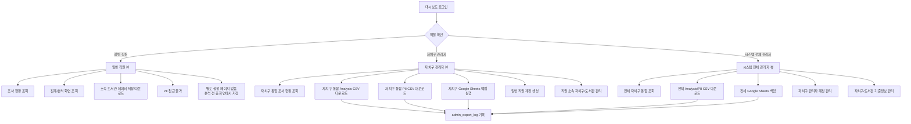

# 조사폼 및 조사결과 저장 구조

이 문서는 LIBanalysis-v2의 기존 대시보드 문서와 분리하여, 조사폼 제출과 조사결과 원천 저장 구조만 다룹니다.

## 문서 범위

- 조사폼 응답 제출 흐름
- 전화번호 암호화 및 중복 응답 방지
- Supabase 원천 저장 구조
- 관리자/일반 직원 권한에 따른 운영 흐름
- Google Sheets 백업과 CSV export 흐름
- 향후 작업 안건

## 핵심 결정

| 항목 | 결정 |
| --- | --- |
| 원천 저장소 | Supabase |
| Google Sheets 역할 | 원천 저장소가 아니라 관리자 백업 출력 대상 |
| 중복 응답 방지 | `phone_hash` unique constraint |
| 전화번호 저장 | 원문 미저장, `phone_hash`와 `phone_encrypted`만 저장 |
| 관리자 페이지 | 대시보드 로그인 이후 자치구 관리자/시스템 전체 관리자 권한에 따라 설정·백업·다운로드 범위 분기 |
| 일반 직원 페이지 | 소속 도서관 데이터만 홈 화면에서 저장/다운로드 가능 |
| CSV export | 분석용 파일과 개인정보 파일 분리 |

## 전체 운영 구조

## 제출 흐름

## DB 구조

## 데이터 산출물 분리 구조

## 권한 및 운영 흐름

## 관리자 작업별 문서화 안건

| 작업 | 설명 | 권한 | 로그 |
| --- | --- | --- | --- |
| 조사 응답 저장 | Netlify Function이 검증/암호화 후 Supabase에 저장 | 서버 전용 | `survey_submission_log` |
| 중복 제출 차단 | `phone_hash` unique constraint로 차단 | 서버/DB | `survey_submission_log` |
| 일반 직원 저장/다운로드 | 소속 도서관 데이터만 저장/다운로드 | 일반 직원 | 필요 시 `admin_export_log` 또는 별도 download log |
| 자치구 통합 Analysis CSV export | 해당 자치구 데이터만 분석용 CSV로 다운로드 | 자치구 관리자 | `admin_export_log` |
| 자치구 통합 PII CSV export | 해당 자치구의 암호화 개인정보 파일 다운로드 | 자치구 관리자 | `admin_export_log` |
| 전체 Analysis/PII export | 전체 자치구 통합 파일 다운로드 | 시스템 전체 관리자 | `admin_export_log` |
| Google Sheets 백업 | 권한 범위에 맞춰 현재 시트 구조와 같은 탭으로 백업 | 자치구 관리자, 시스템 전체 관리자 | `admin_export_log` |
| 일반 직원 계정 생성 | 자치구 관리자가 직원 계정과 소속 도서관 지정 | 자치구 관리자 | 계정 관리 로그 |
| 자치구 관리자 계정 생성/배포 | 시스템 전체 관리자가 자치구별 관리자 계정을 생성하고 배포 | 시스템 전체 관리자 | 계정 관리 로그 |
| 로컬 복호화 | PII CSV를 로컬 키로 복호화 | 지정 운영자 | 로컬 보안 절차 |

## 작업 우선순위

1. Supabase schema 초안 작성
2. `phone_hash` unique constraint 포함 migration 작성
3. Netlify Function 저장 대상을 Supabase로 전환
4. 기존 Apps Script/Google Sheets 저장 흐름을 백업 기능으로 재배치
5. 일반 직원/자치구 관리자/시스템 전체 관리자 권한 모델 정의
6. 시스템 전체 관리자에 의한 자치구 관리자 계정 생성/배포 흐름 정의
7. 자치구 관리자에 의한 일반 직원 계정 생성 및 소속 관리 흐름 정의
8. 권한 범위별 Analysis CSV / PII CSV export 규격 확정
9. Google Sheets 백업 규격 확정
10. 분석 대시보드 입력 구조와 Supabase view/export 매핑

## 로컬 관련 문서

- `docs/supabase-source-of-truth-plan.md`
- `docs/phone-encryption-operations.md`
- `docs/security-data-transfer.md`
- `docs/form-revision-worklist.md`
